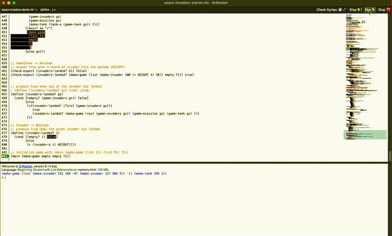

# Space Invaders Game in DrRacket

A simple implementation of the classic Space Invaders game using DrRacket and the `2htdp/universe` library.

## Game Demo

## Game Description

In this version of Space Invaders, players control a tank at the bottom of the screen that can move left and right while shooting missiles at descending invaders. The goal is to destroy the invaders before they reach the bottom of the screen.

## Game Controls

- **Left Arrow**: Move tank left
- **Right Arrow**: Move tank right
- **Spacebar**: Shoot missile
- **R**: Reset game

## Game Features

- Random invader generation with varying speeds and directions
- Collision detection between missiles and invaders
- Game over when invaders reach the bottom

## How to Run

1. Open the file in DrRacket
2. Click "Run" or press Ctrl+R

